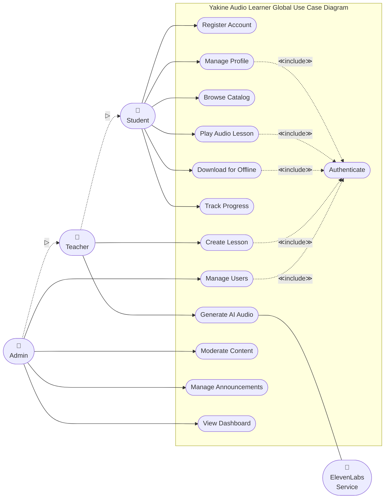
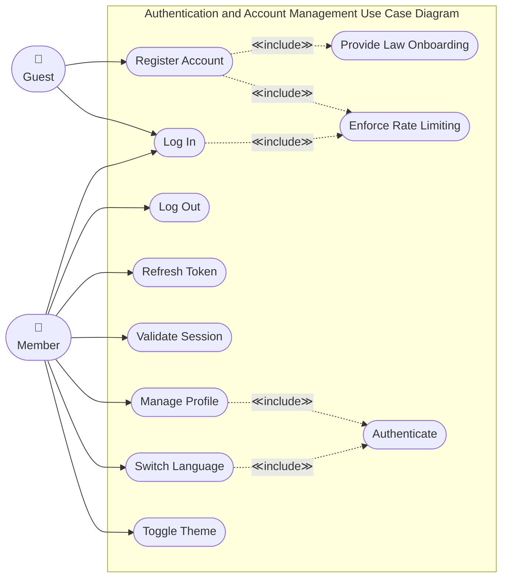
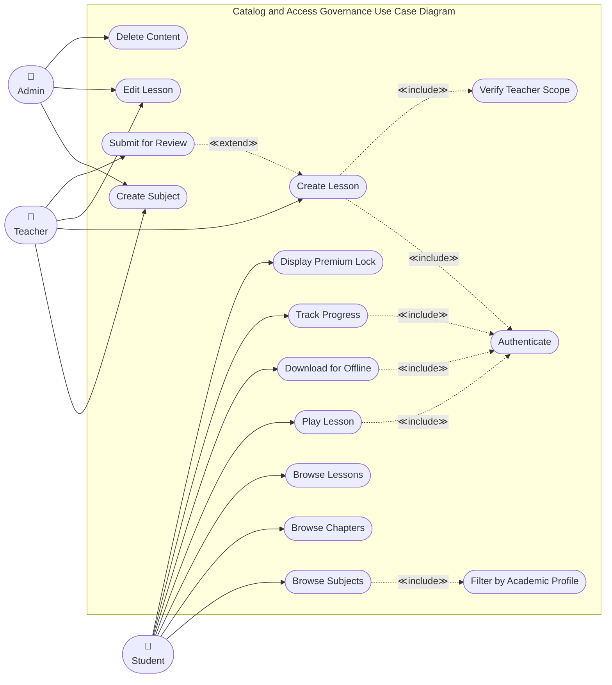
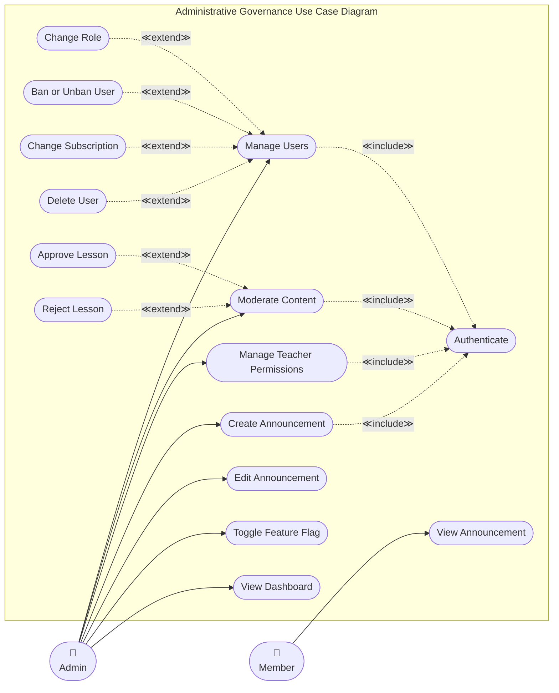
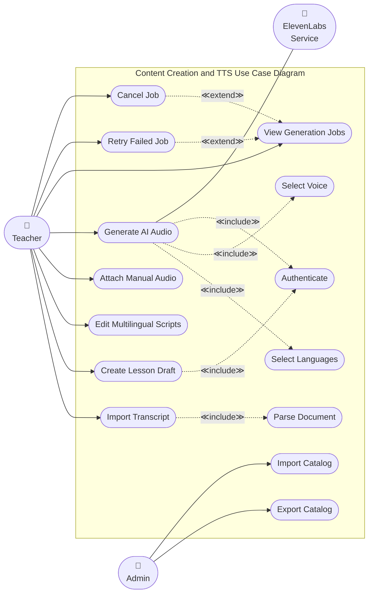

# UML Use Case Diagrams

---

## Diagram 1 — Global Use Case Diagram

---

## Diagram 2 — Authentication and Account Management Use Case Diagram

---

## Diagram 3 — Catalog and Access Governance Use Case Diagram

---

## Diagram 4 — Administrative Governance Use Case Diagram

---

## Diagram 5 — Content Creation and TTS Use Case Diagram

